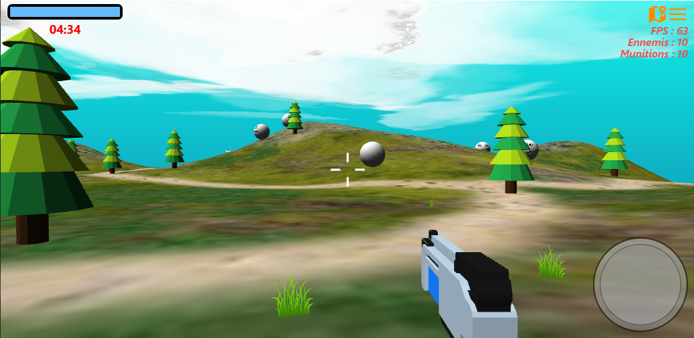

# FMXFPS

This project is a demonstration of using Delphi and Firemonkey.

You need to install my GBE3D components suite (https://github.com/gbegreg/GBE3D) to compile this project.

You will find the executables on: 
http://gbesoft.fr/jeux.php#fmxfps 
https://play.google.com/store/apps/details?id=fr.gbesoft.FMXFPS 
https://gregory-bersegeay.itch.io/fmx-fps 
 

